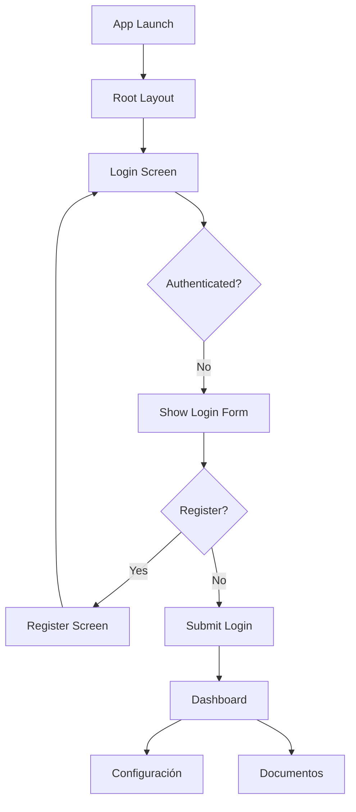

## Overview

DriveLoop Mobile uses **Expo Router** for file-based routing, providing a simple and intuitive navigation structure. The app follows a screen-based architecture where each file in the `app/` directory represents a route.

## Expo Router Basics

Expo Router provides automatic routing based on your file structure:

```plaintext
app/
├── _layout.tsx          # Root layout with font loading
├── login.tsx            # /login route
├── register.tsx         # /register route
└── dashboard.tsx        # /dashboard route
```

<Note>
  Each `.tsx` file in the `app/` directory automatically becomes a route. No manual route configuration needed!
</Note>

## Navigation Hooks

### useRouter Hook

The `useRouter` hook provides programmatic navigation capabilities:

```tsx
import { useRouter } from 'expo-router';

const MyScreen = () => {
    const router = useRouter();

    // Navigate to a new screen
    router.push('/dashboard');

    // Replace current screen (no back navigation)
    router.replace('/dashboard');

    // Go back to previous screen
    router.back();
};
```

<Tabs>
  <Tab title="push()">
    ```tsx
    router.push('/dashboard');
    ```
    
    Navigates to a new screen and adds it to the navigation stack. Users can go back.
  </Tab>
  
  <Tab title="replace()">
    ```tsx
    router.replace('/dashboard');
    ```
    
    Replaces the current screen. Prevents users from navigating back. **Used after login** in DriveLoop.
  </Tab>
  
  <Tab title="back()">
    ```tsx
    router.back();
    ```
    
    Returns to the previous screen in the stack. **Used in the register screen** to go back to login.
  </Tab>
</Tabs>

## Navigation Patterns

### Authentication Navigation

Login screen navigation to dashboard (from `app/login.tsx:46`):

```tsx app/login.tsx
import { useRouter } from 'expo-router';

const Login = () => {
    const router = useRouter();

    return (
        <CustomButton 
            title="Iniciar sesión" 
            onPress={() => router.replace('/dashboard' as any)} 
        />
    );
};
```

<Warning>
  Using `router.replace()` is critical here to prevent users from navigating back to the login screen after authentication.
</Warning>

### Back Navigation

Register screen back button (from `app/register.tsx:18`):

```tsx app/register.tsx
import { MaterialIcons } from '@expo/vector-icons';
import { useRouter } from 'expo-router';

const Register = () => {
    const router = useRouter();

    return (
        <View className="flex-row items-center mt-4">
            <TouchableOpacity onPress={() => router.back()} className="p-2 -ml-2">
                <MaterialIcons name="arrow-back" size={24} color="#111111" />
            </TouchableOpacity>
            <View className="flex-1 items-center mr-8">
                <Text className="text-xl font-roboto-bold text-secondary">Registro</Text>
            </View>
        </View>
    );
};
```

### Link Component

Declarative navigation using the `Link` component (from `app/login.tsx:52`):

```tsx
import { Link } from 'expo-router';

<View className="flex-row justify-center mt-8">
    <Text className="text-gray-500 font-roboto-light">¿No tienes una cuenta? </Text>
    <Link href="/register" asChild>
        <TouchableOpacity>
            <Text className="text-primary font-roboto-bold">Regístrate</Text>
        </TouchableOpacity>
    </Link>
</View>
```

<Note>
  The `asChild` prop allows the Link to wrap a custom component while maintaining its navigation functionality.
</Note>

## Dashboard Navigation

The dashboard serves as the main navigation hub after authentication:

```tsx app/dashboard.tsx
import { FileText, User } from 'lucide-react-native';
import React from 'react';
import { View } from 'react-native';
import Logo from '../components/Logo';
import MenuCard from '../components/MenuCard';
import ScreenLayout from '../components/ScreenLayout';

const Dashboard = () => {
    return (
        <ScreenLayout paddingHorizontal={4}>
            <Logo className="mt-8 mb-12" />

            <View className="space-y-4">
                <View className="flex-row">
                    <MenuCard
                        title="Configuración de cuenta"
                        Icon={User}
                        onPress={() => console.log('Configuración press')}
                    />
                </View>

                <View className="flex-row">
                    <MenuCard
                        title="Documentos"
                        Icon={FileText}
                        onPress={() => console.log('Documentos press')}
                    />
                </View>
            </View>
        </ScreenLayout>
    );
};
```

### MenuCard Navigation

The `MenuCard` component (from `components/MenuCard.tsx`) is designed for dashboard navigation:

```tsx components/MenuCard.tsx
import { LucideIcon } from 'lucide-react-native';
import React from 'react';
import { Text, TouchableOpacity, View } from 'react-native';

interface MenuCardProps {
    title: string;
    Icon: LucideIcon;
    onPress?: () => void;
}

const MenuCard = ({ title, Icon, onPress }: MenuCardProps) => {
    return (
        <TouchableOpacity
            onPress={onPress}
            className="flex-1 border border-primary/20 bg-white rounded-2xl p-6 items-center shadow-sm active:bg-gray-50 m-2"
        >
            <View className="mb-4">
                <Icon size={64} color="#C91843" strokeWidth={1.5} />
            </View>
            <Text className="text-secondary font-roboto-bold text-center text-lg">
                {title}
            </Text>
        </TouchableOpacity>
    );
};
```

<Tip>
  MenuCard uses Lucide React Native icons for a modern, consistent icon set across dashboard navigation.
</Tip>

## Root Layout

The `_layout.tsx` file sets up the root navigation structure:

```tsx app/_layout.tsx
import { useFonts } from 'expo-font';
import { Slot, SplashScreen } from 'expo-router';
import React, { useEffect } from 'react';
import "./global.css";

SplashScreen.preventAutoHideAsync();

const RootLayout = () => {
    const [fontsLoaded, error] = useFonts({
        'Roboto-Bold': require('../assets/fonts/Roboto-Bold.ttf'),
        'Roboto-Light': require('../assets/fonts/Roboto-Light.ttf'),
        'Roboto-Medium': require('../assets/fonts/Roboto-Medium.ttf'),
    });

    useEffect(() => {
        if (error) throw error;
        if (fontsLoaded) SplashScreen.hideAsync();
    });

    if (!fontsLoaded && !error) return null;

    return <Slot />
}
```

<CardGroup cols={2}>
  <Card title="Font Loading" icon="font">
    Loads custom Roboto fonts before rendering the app.
  </Card>
  
  <Card title="Splash Screen" icon="image">
    Manages splash screen visibility until fonts are loaded.
  </Card>
  
  <Card title="Slot Component" icon="square">
    Renders child routes based on the current navigation state.
  </Card>
  
  <Card title="Global Styles" icon="paintbrush">
    Imports NativeWind global CSS for Tailwind support.
  </Card>
</CardGroup>

## Navigation Flow Diagram



## Screen Layouts

All screens use the `ScreenLayout` component for consistent structure:

```tsx components/ScreenLayout.tsx
import React from 'react';
import { ScrollView, View } from 'react-native';
import { SafeAreaView } from 'react-native-safe-area-context';

interface ScreenLayoutProps {
    children: React.ReactNode;
    scrollable?: boolean;
    paddingHorizontal?: number;
}

const ScreenLayout = ({ 
    children, 
    scrollable = true, 
    paddingHorizontal = 6 
}: ScreenLayoutProps) => {
    const Container = scrollable ? ScrollView : View;

    return (
        <SafeAreaView className="flex-1 bg-white">
            <Container
                contentContainerStyle={scrollable ? { flexGrow: 1 } : undefined}
                className={`flex-1 px-${paddingHorizontal}`}
            >
                {children}
            </Container>
        </SafeAreaView>
    );
};
```

### ScreenLayout Features

<Tabs>
  <Tab title="Safe Area">
    ```tsx
    <SafeAreaView className="flex-1 bg-white">
    ```
    
    Ensures content respects device safe areas (notches, status bars).
  </Tab>
  
  <Tab title="Scrollable">
    ```tsx
    scrollable = true
    ```
    
    Toggles between `ScrollView` and `View` for scrollable or fixed layouts.
  </Tab>
  
  <Tab title="Padding">
    ```tsx
    paddingHorizontal = 6
    ```
    
    Customizable horizontal padding using Tailwind spacing scale.
  </Tab>
</Tabs>

## Navigation TypeScript Types

<Note>
  You may notice `as any` type assertions in navigation calls. This is a temporary workaround for Expo Router type definitions.
</Note>

```tsx
// Current implementation
router.replace('/dashboard' as any)

// Better TypeScript support (future)
router.replace('/dashboard')
```

## Best Practices

<Steps>
  <Step title="Use router.replace() for auth flows">
    Prevent users from navigating back to login screens after authentication.
  </Step>
  
  <Step title="Use Link for declarative navigation">
    Prefer `Link` component for static navigation links in your UI.
  </Step>
  
  <Step title="Use router.push() for dynamic navigation">
    Use programmatic navigation when responding to user actions or business logic.
  </Step>
  
  <Step title="Wrap custom components with asChild">
    When using Link with custom components, use the `asChild` prop.
  </Step>
</Steps>

## Common Navigation Patterns

<CardGroup cols={2}>
  <Card title="Post-Login Redirect" icon="right-to-bracket">
    ```tsx
    router.replace('/dashboard')
    ```
  </Card>
  
  <Card title="Back Button" icon="arrow-left">
    ```tsx
    router.back()
    ```
  </Card>
  
  <Card title="Tab Navigation" icon="table-columns">
    ```tsx
    <Link href="/settings">Settings</Link>
    ```
  </Card>
  
  <Card title="Modal Navigation" icon="window-maximize">
    ```tsx
    router.push('/modal')
    ```
  </Card>
</CardGroup>

## Next Steps

<Steps>
  <Step title="Add Protected Routes">
    Implement authentication guards to protect dashboard routes.
  </Step>
  
  <Step title="Add Tab Navigation">
    Create a tab layout using Expo Router's `(tabs)` directory convention.
  </Step>
  
  <Step title="Add Modal Routes">
    Use Expo Router's modal presentation mode for overlay screens.
  </Step>
  
  <Step title="Add Deep Linking">
    Configure deep links for external navigation into your app.
  </Step>
</Steps>

<Tip>
  Explore Expo Router's [documentation](https://docs.expo.dev/router/introduction/) for advanced navigation patterns like nested routes, layouts, and modals.
</Tip>